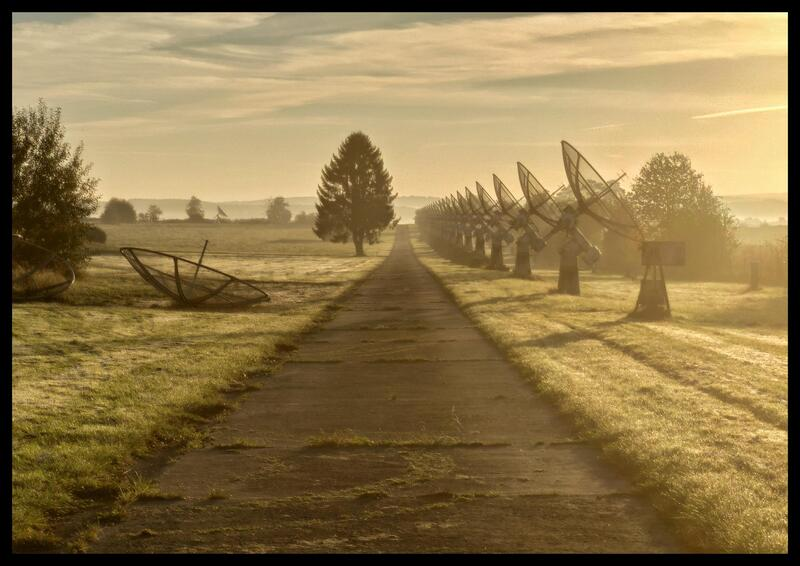

Walric - Wallpapers obtained by Reddit Image Crawling
=====================================================

Walric is a command-line tool that helps you build a collection of images
curated by the Reddit community. This collection can then be queried to find
images to use as your desktop wallpaper(s).

::

    _________________________________________________________________
   / Title       Abandoned observatory in the fog [oc]               \
   | Author      u/dulln                                             |
   | Subreddit   AbandonedPorn                                       |
   | Posted At   2021-10-28 19:07:37 UTC                             |
   | Permalink   https://reddit.com/r/AbandonedPorn/comments/qhrmei/ |
   | Image URL   https://i.redd.it/ug7tltjs38w71.jpg                 |
   | Image Size  4000 x 2828                                         |
   | Filename    /home/walric/AbandonedPorn/qhrmei-ug7tltjs38w71.jpg |
   | NSFW        false                                               |
   \ Walric ID   6774                                                /
    -----------------------------------------------------------------
           \  ^___^
            \ (...)\_______
              (___)\       )\/\
                   ||----w |
                   ||     ||

Usage
-----

Overview
~~~~~~~~

Walric:

- crawls a list of subreddits,
- looks for posts containing images,
- downloads the images to a local directory, and a sub-directory per subreddit,
- stores Reddit post and image metadata in a local SQLite3 database.

Take a look at the following threads to find interesting content ;-)

- `List of Art subreddits
  <https://www.reddit.com/r/redditlists/comments/141nga/list_of_art_subreddits/>`_
- `What are the best photo-based subreddits?
  <https://www.reddit.com/r/AskReddit/comments/4i3rby/what_are_the_best_photobased_subreddits/>`_
- `A list of all photography related subreddits?
  <https://www.reddit.com/r/photography/comments/15xui8/a_list_of_all_photography_related_subreddits/>`_

Configuration
~~~~~~~~~~~~~

Walric uses a TOML configuration file, located by default under
`~/.config/walric.toml`.

::

   [reddit]
   user_agent = "Comment Extraction (by /u/<YOUR_USER_ID>)"

   [walric]
   data_dir = "/home/walric"
   submission_limit = 20
   time_filter = "month"
   subreddits = [
     "AbandonedPorn"
     "Castles",
     "Museum",
   ]

Acknowledgements
----------------

Walric runs thanks to:

- the `vartanbeno/go-reddit <https://github.com/vartanbeno/go-reddit>`_ HTTP client;
- the `vcraescu/go-xrandr <https://github.com/vcraescu/go-xrandr>`_ wrapper;
- the `SQLite <https://sqlite.org/index.html>`_ database engine,
  and `mattn/go-sqlite3 <https://github.com/mattn/go-sqlite3>`_ wrapper;
- the `jmoiron/sqlx <https://github.com/jmoiron/sqlx>`_ extension to ``database/sql``;
- the `golang-migrate/migrate <https://github.com/golang-migrate/migrate>`_ database migration
  library;
- the `spf13/cobra <https://github.com/spf13/cobra>`_ command-line library;
- the `rs/zerolog <https://github.com/rs/zerolog>`_ structured logger;
- the `TOML <https://toml.io/en/>`_ configuration file format
  and `BurntSushi/toml <https://github.com/BurntSushi/toml>`_ parser.

Walric is the successor to `Redwall <https://github.com/virtualtam/redwall>`_.

License
-------

Walric is licenced under the MIT License.
